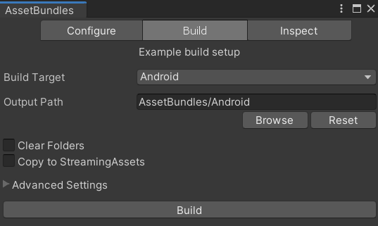
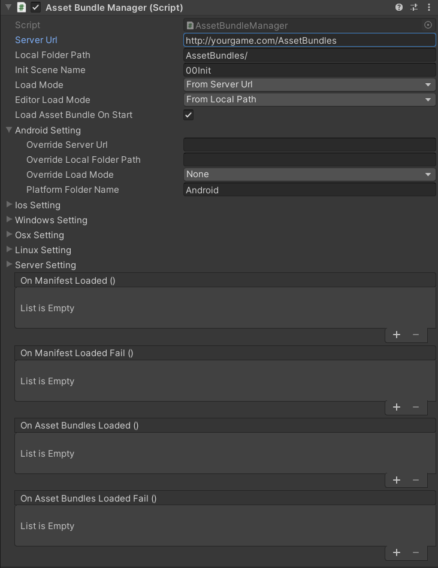
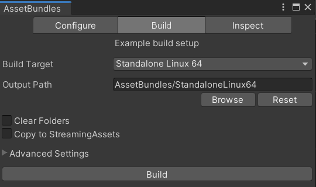
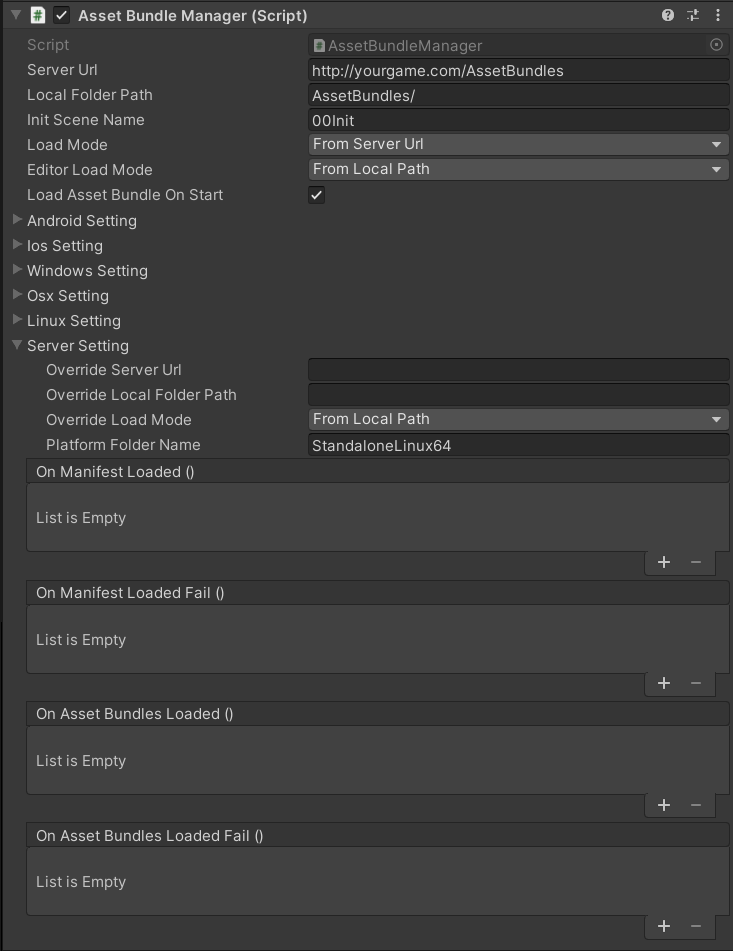
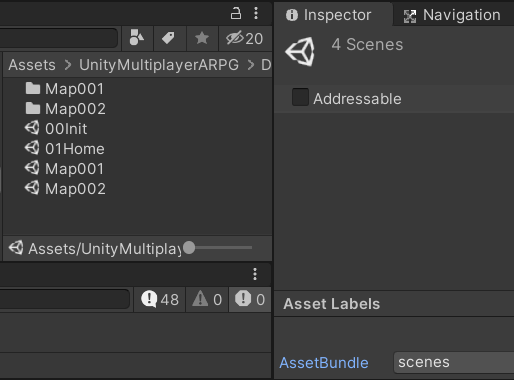
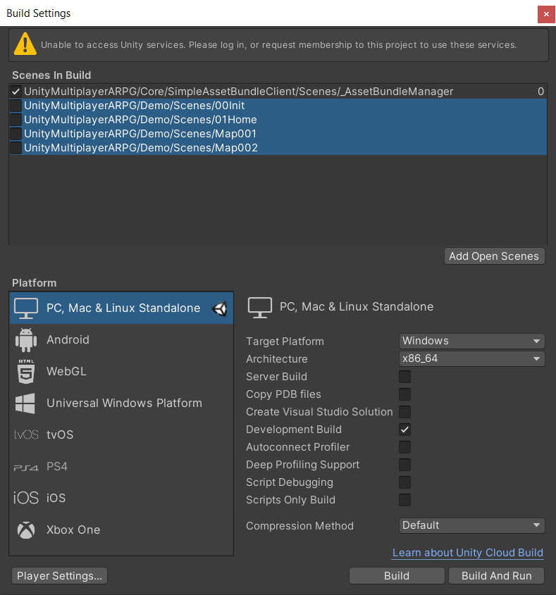

# SimpleAssetBundleClient
A simple asset bundle client which is not best solution for your game, it will download all asset bundles which defined in platform manifest when start the game, if you like to load just some asset partially when change map or something you should find other solution.

* * *

## How to use

- You have to know how to prepare asset bundles, you can use https://docs.unity3d.com/Manual/AssetBundles-Browser.html to create asset bundles file or other solution.
- You also have to know how to upload files to web-server. Because you have to upload asset bundles files for the clients.
- You also can create asset bundle files for the game-server.
- Set configs in `AssetBundleManager` component:
  - `Server Url` is URL to where which contains all asset bundles for all platforms, in this folder will contains asset bundle folders for specific platforms such as **StandaloneLinux64**, **StandaloneWindows64**, **Android** and so on. This URL will be used while `Load Mode` is `From Server Url`.
  - `local Folder Path` is relative path from executable file (such as Project.exe) to folder which contains all asset bundles for the build platform, in this folder still have to contains asset bundle folders for specific platform, for example if I've built the game-server which running on **StandaloneLinux64** to `/root/project/` then upload asset bundles to `/root/project/assetbundle/StandaloneLinux64`, I will set this config to `/assetbundle`.
  - `Init Scene Name` is a scene name which will be loaded after all asset bundles downloaded.
  - `Load Mode` load mode for the executable file, it can be overrided by specific platform settings.
  - `Editor Load Mode` load mode for the Unity editor, it can be overrided by specific platform settings.
- You can exclude scenes which included in asset bundles from `Scenes In Build` setting and may set asset bundle loading scene as a initializing scene.
- You should disable `Strip Engine Code` because if there are gameplay scenes which included in asset bundles were excluded from `Scenes In Build`, some codes will be excluded from the build too, so your game may not work properly.

* * *

### How to setup for Android client example

- Build asset bundles for `Android`

- After asset bundles were built, upload them to web-server, for example, upload to `http://yourgame.com/AssetBundles/Android`.
- Create new scene which will be used as asset bundles loading scene, add `AssetBundleManager` to any game object, then setup loading UI as you wish.
- Then in `AssetBundleManager` component set `Server Url` to `http://yourgame.com/AssetBundles`.
- Set `AssetBundleManager` -> `loadMode` to `LoadMode.FromServerUrl` because the clients gonna load asset bundles from server (`http://yourgame.com/AssetBundles/Android`), not from the device.
- Set `AssetBundleManager` -> `androidSetting` -> `platformFolderName` to `Android`.
- Set `AssetBundleManager` -> `initSceneName` to `00Init` to make it load that scene after all asset bundle files were loaded.

* * *

### How to setup for Linux x86_84 server example

- Build asset bundles for `StandaloneLinux64`.

- After asset bundles were built, copy or upload files to where the execution files located, for example, if I built game-server to `/root/gserver` I will copy files to `/root/gserver/AssetBundles/StandaloneLinux64`.
- Set `AssetBundleManager` -> `serverSetting` -> `overrideLoadMode` to `LoadMode.FromLocalPath` because it is gonna load asset bundle files from the device, not server.
- Set `AssetBundleManager` -> `serverSetting` -> `overrideLocalFolderPath` to `AssetBundles` because it is gonna load asset bundle files from `/root/gserver/`**AssetBundles**`/StandaloneLinux64`.
- Set `AssetBundleManager` -> `serverSetting` -> `platformFolderName` to `StandaloneLinux64` because it is gonna load asset bundle files from `/root/gserver/AssetBundles/`**StandaloneLinux64**.

* * *

### What is "exclude scenes which included in asset bundles"?

Let's says that we have following scenes: 
- 00Init
- 01Home
- Map001
- Map002

That were included in asset bundles

We can exclude them

Then when the game started, it will load `_AssetBundleManager` scene, then in `_AssetBundleManager` it has `AssetBundleManager` component which will download asset bundles from server.

After all files were loaded it will load the scene which is `AssetBundleManager` -> `initSceneName` setting, So from above example it will load `00Init` scene.